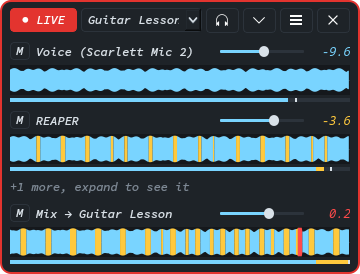
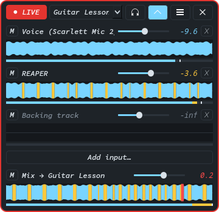

# OneMic

Blend any audio signals on Linux into one virtual microphone.



Browsers, and so every web call (Meet, Jitsi, Tutorful, Discord in the browser), let a site pick exactly
one microphone. An audio interface shows up as several separate inputs, and an amp-sim guitar is not on
any of them: the dry signal comes in on one input, but the actual tone only exists inside the DAW after
its plugins. If you want the other end of the call to hear your voice *and* your guitar, you are stuck.

OneMic fixes that. It creates a virtual microphone, feeds as many signals into it as you like (a mic,
your DAW, a backing track playing in the browser), gives each one its own volume and mute, and shows
you exactly what the call is hearing. Pick the OneMic device in your call and you are done.

It started life as a small shell script (`call-mic`) for guitar lessons. OneMic is the grown-up version:
named mics you can save and switch between, live waveforms, and it keeps everything linked as devices
and applications come and go.

## Features

| Feature | What it does |
| --- | --- |
| Named virtual mics | Each mic is a real PipeWire device, listed in call apps as `<name> (OneMic)`. Save as many as you like and switch between them. |
| Up to 8 inputs per mic | Any microphone or interface input, any application playing audio (REAPER, a browser), or anything a speaker is playing. |
| Volume and mute per input | Set each signal without touching the source itself, so REAPER still records and monitors exactly as before. |
| Master volume and mute | For the mix as a whole, which is what the call hears. |
| Live waveforms and meters | A smoothly scrolling waveform and a DAW-style level meter for each input and for the mix. Ice blue when fine, yellow when running hot, red where it clipped. |
| Peak readout with hold | The highest recent peak in dBFS next to each waveform, held long enough to read. |
| Listen | Hear exactly what the mic is sending, through your default output. |
| Auto-relink | Opened REAPER after going live? Replugged the interface? OneMic links it back within a second. |
| Small and always on top | Sits in a screen corner, shows two inputs and the mix, and expands to show everything. |
| Remembers its place | Drag it to any corner of any screen and it snaps there, and reopens there next time. |
| Safe closing | Closing while live asks whether to keep the mic running for your call or stop it. |

The expanded view, with every input and the add button:



## How it works

Nothing in OneMic touches audio samples on the way to the call. It only builds and maintains a small
piece of the PipeWire graph, so the audio path is exactly as fast and as reliable as PipeWire itself:

```
voice mic ────► gain stage (volume, mute) ──┐
REAPER out 1/2 ► gain stage (volume, mute) ──┼──► OneMic virtual mic ──► your call
backing track ─► gain stage (volume, mute) ──┘          │
                                                        └──► default output (only while Listen is on)
```

| Piece | Built with | Why |
| --- | --- | --- |
| Virtual mic | `pactl load-module module-null-sink` with the `Audio/Source/Virtual` class | The simplest virtual microphone PipeWire offers. It survives OneMic closing. |
| Gain stages | one `pw-loopback` process per input | A link has no volume of its own. A loopback stream does, so each input gets a volume and mute without changing the source for other applications. |
| Links | `pw-link`, planned from `pw-dump` snapshots | OneMic compares the graph with what the mic should look like once a second, links anything missing and removes anything stale. |
| Levels | `wpctl set-volume` and `set-mute` | The same volume scale as the desktop's own mixer. |
| Waveforms | one `pw-record` tap per visible signal | Metering is only another link, so it can never change or interrupt what the call hears. |

The links are copies. Your DAW still plays to your headphones, your interface inputs still feed the DAW,
and nothing is recorded any differently.

## Platform support

OneMic runs on **Linux with PipeWire** only. Every part of it talks to PipeWire through the tools that
ship with it (`pw-dump`, `pw-link`, `pw-loopback`, `pw-record`) plus `pactl` from `pipewire-pulse` and
`wpctl` from WirePlumber. That covers every current desktop distribution using PipeWire, which is most of
them. It will not work on a PulseAudio-only or JACK-only system.

It is developed and tested on Arch Linux with KDE Plasma on X11. It has not been tested on Wayland.
The audio side does not care, but Wayland does not let applications position their own windows, so
dragging and corner snapping will not work there.

## Requirements

- Linux with PipeWire, `pipewire-pulse` and WirePlumber
- Python 3.12 or newer
- `python-pyside6` 6.11 or newer
- `python-numpy`

On Arch Linux:

```bash
sudo pacman -S pipewire pipewire-pulse wireplumber python-pyside6 python-numpy python-pipx
```

If you use a DAW through JACK, install `pipewire-jack` as well so it appears in the PipeWire graph.

## Installation

Clone the repository and install it with `pipx`:

```bash
git clone https://github.com/LukeMcCann/onemic.git
cd onemic
pipx install --system-site-packages --editable .
```

`--system-site-packages` reuses the distribution's PySide6 and NumPy, which are large and already
installed. `--editable` makes the installed command run the cloned folder, so pulling changes updates
it without reinstalling.

`pipx` puts an `onemic` launcher in `~/.local/bin`. If `command -v onemic` finds nothing, run
`pipx ensurepath` and open a new terminal.

To add OneMic to the application menu:

```bash
install -Dm644 /dev/stdin ~/.local/share/applications/onemic.desktop <<'EOF'
[Desktop Entry]
Type=Application
Name=OneMic
Comment=Blend audio signals into one virtual microphone
Exec=onemic
Icon=audio-input-microphone
Categories=AudioVideo;Audio;Mixer;
EOF
```

Without `pipx`, you can run it straight from the source folder with `python -m onemic`.

## Usage

### Your first mic

1. Start OneMic. It opens in the bottom-right corner with an empty mic called **My Mic**.
2. Click **Add input…**, pick a source, and repeat for each signal you want. Sources are grouped into
   microphones and inputs, applications, and speakers (what they are playing).
3. Check the waveforms. Before going live, each input's waveform shows its source directly, so you can
   set your interface gain and spot a dead input before anything reaches a call.
4. Click **GO LIVE**. The button turns red and reads **● LIVE**, and the window gets a red border. From
   here each input's waveform shows it after its volume and mute, and the mix row shows what the call
   hears.
5. In your call, choose **My Mic (OneMic)** as the microphone.

To give the mic a better name, open the **⋮** menu, choose **Manage mics…**, and rename it. Call apps
show whatever name you pick, so something like `Guitar Lesson` is easy to find in a device list.

### Setting levels

Each row has a mute button (**M**), a volume slider from 0 to 150%, the held peak in dBFS, the
waveform, and a thin level meter under it. The bottom row is the mix, which is exactly what the call
hears.

The meter is the live part: it jumps the instant a sound starts and falls back smoothly, with a white
tick marking the recent peak, just like a DAW's track meter. The waveform shows the last few seconds
scrolling past. Both use a decibel scale from -60 dBFS to full scale, the way DAW meters do, so a voice
at a normal speaking level fills a good part of the lane rather than a sliver.

| Colour | Peak | Meaning |
| --- | --- | --- |
| Ice blue | below -6 dBFS | Fine. |
| Yellow | -6 dBFS and above | Running hot. The far end's browser adds its own gain on top, so back it off. |
| Red | -0.1 dBFS and above | Clipping. The call will hear distortion. |

Each column of the waveform is coloured by its own level, so a clip shows red exactly where it happened
while the rest stays blue. Aim for a mix peaking around -10 dBFS. If a DAW is involved, pulling its
master fader down about 10 dB (and turning up your headphones instead) is usually all it takes.

### Listen

The headphones button plays the mic through your default output, so you can hear exactly what the call
is getting. It needs a live mic, so it stays greyed out until you go live. If your DAW already plays to the same headphones you will hear it twice while this is on,
which is expected. Listen is disabled if your default output is one of the mic's own inputs, because
the mic would then hear itself and howl.

### Compact and expanded

The window normally shows the first two inputs and the mix, which is enough to keep an eye on things
during a call. The arrow button expands it to show every input, along with each row's remove button and
**Add input…**. Only visible rows are metered, so the compact view also costs less.

### Moving the window

Drag the window by any empty area and let go. It snaps to the nearest corner of that screen, and next
time it opens in the same corner of the same screen. Expanding grows the window away from its corner,
so it never goes off screen.

### Several mics

Every mic keeps its own inputs and levels, and every change is saved as you make it. Switch mics from
the drop-down in the header. If a mic is live when you switch, the one you pick goes live in its place:
only one OneMic mic is live at a time, so a call app never shows two half-built devices.

**Manage mics…** creates, copies, renames and deletes mics. The live mic cannot be renamed or deleted,
because its name is part of every PipeWire node it owns and changing it would drop the call.

### Closing

If nothing is live, closing just closes. If a mic is live, OneMic asks:

- **Keep live** leaves the mic running for your call. Levels stay as they are. Listen is switched off,
  because there would be no way to switch it off again with the window closed.
- **Stop mic** removes the mic and its gain stages.

Opening OneMic again finds a mic that was left live and picks up where it left off.

## Using it in a call

- **Choose the device.** Most call apps list it as `<name> (OneMic)`. In a browser, change it from the
  site's settings or from the camera and mic icon in the address bar.
- **Turn off noise suppression and automatic gain** in the call app if it allows. They are tuned for
  speech and will chop the sustain off a guitar.
- **Test before the call.** [meet.jit.si](https://meet.jit.si) with your phone as the second participant
  is a quick way to hear what the other end gets.

## Where settings are stored

| File | Contents |
| --- | --- |
| `~/.config/onemic/mics.json` | Every mic, its inputs and levels, and which one was last selected. |
| `~/.config/onemic/window.json` | The window's corner, screen and whether it was expanded. |

Both are plain JSON and safe to edit by hand while OneMic is closed. If a file cannot be read, OneMic
moves it aside to `*.broken` rather than overwriting it, and starts fresh.

## Troubleshooting

**An input says it is waiting for its source.** The source is not in the PipeWire graph right now,
usually because the application is closed or the device is unplugged. Open or plug it in and OneMic
links it within a second.

**The call hears nothing.** Check the call app is using the OneMic device, the mix row is not muted, and
the mix waveform is moving. If the mix moves but the call is silent, the call app is using a different
microphone.

**A source is missing from Add input.** Only nodes with audio outputs are listed. A DAW has to be
running, and a JACK application needs `pipewire-jack`.

**See what OneMic is doing.** Run it from a terminal with `onemic --verbose` to log every link change.
`qpwgraph` shows the whole graph, where OneMic's nodes all start with `onemic.`.

**Remove a mic by hand.** If OneMic is not running and a mic is still live, `pactl list short modules |
grep onemic` shows the module to `pactl unload-module`, and `pkill -f 'pw-loopback.*onemic'` stops the
gain stages. Restarting PipeWire also clears everything.

## Development

Create a virtual environment that can see the system's PySide6, and install the development tools:

```bash
python -m venv --system-site-packages .venv
.venv/bin/pip install -e '.[dev]'
```

Then:

```bash
.venv/bin/ruff check onemic tests      # lint
.venv/bin/ruff format onemic tests     # format
.venv/bin/mypy                         # strict type checking
.venv/bin/pytest --cov                 # tests with coverage
```

The tests never touch the real audio graph. Session tests run against `FakePipeWire` in
`tests/fakes.py`, an in-memory graph that creates nodes and ports, removes them when their process
stops, and records links, so they read like real use. Interface tests use `pytest-qt` with Qt's
offscreen platform, which is also what CI uses.

### Architecture

The code follows a ports and adapters layout. Dependencies only point inwards:

| Layer | Folder | Responsibility |
| --- | --- | --- |
| Domain | `onemic/domain` | Plain data and rules: the graph snapshot, mics and inputs, node naming, levels, waveforms. No I/O. |
| Ports | `onemic/ports.py` | Protocols for everything outside the process: commands, PipeWire, stores. |
| Services | `onemic/services` | The session that keeps a mic wired and levelled, the supervisor that starts and stops its nodes, the routing planner, metering, the mic library, and the background worker. |
| Adapters | `onemic/infrastructure` | The only code that runs PipeWire's tools or reads and writes files. |
| Interface | `onemic/ui` | Qt widgets that show state and report intent, and the controller that connects them to the services. |
| Composition root | `onemic/wiring.py` | The one place that picks concrete implementations. |

A few decisions worth knowing before changing things:

- **The graph is the state.** Every node name is derived from the mic's name, so OneMic keeps no record
  of what it started. The session reads the graph, compares it with the saved mic, and converges on it.
  The same code builds a mic, repairs it, and adopts one left live by an earlier run.
- **All graph work runs on one background thread.** Reading the graph takes tens of milliseconds, which
  would stutter the waveforms. Jobs of the same kind replace each other while queued, so dragging a
  slider can never build up a backlog.
- **Old answers are ignored.** Each click starts a new generation, and a routine repair that was already
  running when you clicked cannot report back over it and flip the controls to a state you just left.
- **Failures undo themselves.** A mic that fails part-way through going live is removed again, and a
  failed listen change keeps the old setting, so the controls always match what is really running.
- **OneMic only ever stops `pw-loopback`.** Process ids come from the graph, and every one is checked
  against `/proc` before it is signalled.
- **A call app recording the mic is never unlinked.** Routing only manages links into OneMic's own nodes,
  out of its gain stages, and from the mic to the outputs OneMic itself played it through for Listen.
  A link you make by hand from the mic to anything else is left alone.

## Licence

MIT. See [LICENSE](LICENSE).
